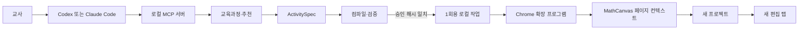

# 아키텍처

## 한 줄 구조

교사 대화는 로컬 MCP 서버가 해석하고, Chrome 확장 프로그램은 검증된 생성 payload만 로그인된 MathCanvas 페이지 안에서 `POST /api/project`로 전달합니다.

## 신뢰 경계

1. AI 경계: 교사 요청, 추천, `ActivitySpec`, 검증 결과만 다룹니다.
2. 로컬 IPC 경계: `127.0.0.1:38471`에만 열리고 256비트 연결 코드와 `chrome-extension://` Origin을 모두 요구합니다.
3. 브라우저 경계: MathCanvas 토큰은 MAIN world 함수의 지역 변수로만 읽고 사용합니다. 함수 결과와 브리지 메시지에는 토큰이 없습니다.
4. 외부 쓰기 경계: 교사 승인 해시, payload 해시, 검증 보고서가 모두 맞을 때 새 프로젝트 POST 한 번만 허용합니다.

## 코어

- 엄격한 Zod 스키마와 버전
- 공식 교육과정 우선 resolver
- 검증된 첫 템플릿
- 결정적 문제 생성
- MathCanvas 네이티브 객체 컴파일러
- 수학·교수학습·배치·상호작용·계약 validator
- MCP 도구 4개
- 인증된 로컬 브리지와 중복 생성 방지
- MV3 Chrome 브리지

추천 초안과 브리지 작업은 `~/.mathcanvas-ai-authoring/drafts.json`, `bridge-jobs.json`에 인증 정보 없이 원자적으로 저장합니다. MCP 서버나 컴퓨터가 재시작되어도 같은 승인에는 같은 작업 ID와 payload 해시를 이어서 사용합니다. 교사가 새 추천을 받고 다시 승인하면 같은 조건이어도 새 프로젝트를 만듭니다.

Chrome은 1분마다 로그인 상태를 확인하지만 공개 계약 fixture 전체 검사는 성공 결과를 6시간 동안 캐시합니다. 시작·설치·수동 새로고침 때와 실제 생성 작업을 가져온 뒤 외부 쓰기 직전에는 전체 계약을 다시 확인합니다. 전체 계약 검사에 실패하면 15분 자동 백오프를 적용하고 수동 확인은 즉시 재시도합니다. 완료·실패·만료된 브리지 작업은 최근 500건까지만 보관하고, 진행 중인 작업은 가지치지 않습니다. 추천 초안은 만료 초안을 먼저 지운 뒤 최근 100건까지만 보관합니다.

## 확장 경계만 있는 기능

`RemoteRecommendationProvider`, `AdditionalTemplateProvider`, `StudentActivityPublisher`, `ExtensionDistributionChannel` 인터페이스만 선언되어 있습니다. v0.1에서는 네트워크 호출이나 가짜 구현을 제공하지 않습니다.

## 동시 실행

Codex와 Claude Code는 같은 stdio MCP 서버 명령을 각각 등록하지만 브리지 포트는 하나입니다. v0.1은 한 번에 한 AI 앱을 사용하는 단일 사용자 구조입니다.
